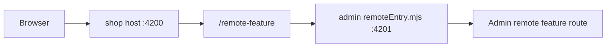

# Module Federation Developer Guide

## What Module Federation Is

Module Federation lets one built application load code from another built application at runtime. In this workspace, the `shop` app can load a route exposed by the `admin` app without bundling that route into `shop` at build time.

## Host And Remote

- Host: the application users enter first. It owns top-level navigation and decides where remote features appear.
- Remote: an independently built application that exposes routes or components for a host to load.

Current setup:

- Host: `shop`
- Remote: `admin`
- Remote route in host: `/remote-feature`
- Remote entry URL in local development: `http://localhost:4201/remoteEntry.mjs`



## File-By-File Explanation

- `apps/shop/module-federation.config.ts`: declares `shop` as the host and registers `admin` as a remote.
- `apps/shop/webpack.config.ts`: wraps the host build with Nx Module Federation.
- `apps/shop/webpack.prod.config.ts`: production host MF config, where deployed remote URLs should be set.
- `apps/shop/project.json`: switches `shop` to the Nx Webpack browser builder and MF dev server.
- `apps/shop/src/main.ts` and `apps/shop/src/bootstrap.ts`: split bootstrap so Module Federation can initialize before Angular starts.
- `apps/shop/src/app/app.routes.ts`: lazy-loads `admin/Routes` at `/remote-feature`.
- `apps/admin/module-federation.config.ts`: declares `admin` as a remote and exposes `./Routes`.
- `apps/admin/webpack.config.ts`: wraps the remote build with Nx Module Federation.
- `apps/admin/webpack.prod.config.ts`: production remote MF config.
- `apps/admin/project.json`: switches `admin` to the Nx Webpack browser builder and serves it on port `4201`.
- `apps/admin/src/app/remote-entry/entry.routes.ts`: exported route contract consumed by the host.
- `apps/admin/src/app/remote-entry/entry.ts`: simple standalone component rendered by the exposed route.
- `tsconfig.base.json`: maps `admin/Routes` for TypeScript.
- `eslint.config.mjs`: allows the virtual `admin/Routes` import while keeping normal Nx boundary rules.

## How To Run Locally

Run the host with the remote in live-development mode:

```sh
npm exec -- nx serve shop --devRemotes=admin
```

Then open:

```text
http://localhost:4200/remote-feature
```

Nx serves the host on `4200` and the remote on `4201`. The host loads the remote's `remoteEntry.mjs` at runtime.

## How To Add A New Remote

1. Create or choose an Angular app boundary.
2. Run the compatible Nx Module Federation setup for that app as a remote.
3. Add the remote name to the host `remotes` array.
4. Add a TypeScript path for the exposed module if Nx does not add it.
5. Add a host route that lazy-loads the remote contract.
6. Run build, lint, tests, and browser verification.

## How To Expose A New Feature Or Component

For a route, add a route file in the remote:

```ts
export const remoteRoutes = [{ path: '', component: SomeRemoteComponent }];
```

Expose it in the remote config:

```ts
exposes: {
  './SomeFeatureRoutes': 'apps/admin/src/app/some-feature/some-feature.routes.ts',
}
```

For a standalone component, expose the component file directly and load it from the host with the Angular pattern appropriate for that component.

## How To Consume A Remote Route In The Host

Add a lazy route in the host:

```ts
{
  path: 'remote-feature',
  loadChildren: () => import('admin/Routes').then((m) => m.remoteRoutes),
}
```

The import is resolved by Module Federation at runtime and by `tsconfig.base.json` during TypeScript checks.

## Shared Dependency Rules

Angular packages and `rxjs` are shared as singletons. A shared singleton means the host and remote use one runtime instance of that dependency instead of loading separate copies.

Angular should not be duplicated because two Angular runtimes can break dependency injection, routing, zones, and component rendering. Internal workspace libraries are not broadly shared by default; prefer explicit public contracts between host and remote.

## Common Errors And Fixes

- `Cannot find module 'admin/Routes'`: check `tsconfig.base.json` and the remote `exposes` key.
- Remote route is blank: confirm the remote app is running and `http://localhost:4201/remoteEntry.mjs` returns JavaScript.
- `remoteEntry.mjs` 404: verify the remote port and the host `remotes` config.
- Nx module-boundary lint error: add a narrow allow entry for the virtual remote import only.
- Duplicate Angular/runtime injection errors: verify Angular packages are shared as singletons and versions are compatible.
- Works locally but not in production: update production remote URLs in `apps/shop/webpack.prod.config.ts`.

## Deployment Checklist

- Build host and remote with production configuration.
- Deploy each app's browser output to static hosting.
- Set production remote URLs in the host config.
- Keep host and remote Angular/Nx/shared dependency versions compatible.
- Cache hashed app assets aggressively, but treat `remoteEntry.mjs` carefully because stale remote entries can point to missing chunks.
- Roll out host and remote changes together when exposed route contracts change.
